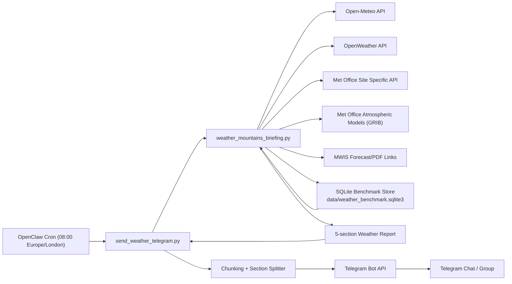

# Yuen Yuen Weather Bot

Yuen Yuen Weather Bot generates a daily Scotland mountain briefing, benchmarks forecast sources, and sends the report to Telegram with safe chunking.

## Project Scope

- Daily zone forecasts for:
  - Glencoe
  - Ben Nevis
  - Glenshee
  - Cairngorms
- Source benchmarking with rolling confidence
- Telegram delivery that splits long reports into multiple messages

## Infrastructure Diagram



## Scripts

- `scripts/weather_mountains_briefing.py`
  - Pulls forecast data from configured providers
  - Stores forecast/actual history in SQLite
  - Computes benchmark/confidence
  - Prints final 5-section weather report
- `scripts/send_weather_telegram.py`
  - Runs briefing script
  - Splits oversized output by sections/chunks
  - Sends chunked plain-text messages to Telegram

## Report Layout

1. Latest forecast by zone (with briefing)
2. Latest benchmark
3. Suitability for Cycling/Hiking/Skiing
4. Forecasting source with confidence %
5. Latest Full PDF links

## Requirements

- Python 3.10+
- `requests`
- Optional: `eccodes` for Met Office atmospheric GRIB decoding

Install:

```bash
python3 -m pip install --upgrade requests
```

Optional:

```bash
python3 -m pip install --upgrade eccodes
```

## Configuration

Put env vars in `.env` (or `~/.openclaw/.env` on Pi).

### Core

- `WEATHER_BENCHMARK_DATA_DIR` (optional data path)
- `TELEGRAM_BOT_TOKEN` (required for Telegram sender)
- `WEATHER_TELEGRAM_CHAT_ID` (optional recipient override)

### Forecast APIs

- `METOFFICE_API_KEY`
- `METOFFICE_DATASOURCE` (default `BD1`)
- `METOFFICE_ATMOS_API_KEY`
- `METOFFICE_ATMOS_ORDER_ID`
- `METOFFICE_ATMOS_MAX_FILES`
- `METOFFICE_ATMOS_MAX_FILE_MB`
- `OPENWEATHER_API_KEY`
- `OPENWEATHER_MODE` (default `auto`)
- `GOOGLE_WEATHER_ACCESS_TOKEN` (preferred)
- `GOOGLE_WEATHER_API_KEY` (fallback)
- `GOOGLE_WEATHER_QUOTA_PROJECT` (or `GOOGLE_CLOUD_PROJECT`)
- `GOOGLE_WEATHER_UNITS_SYSTEM` (default `METRIC`)
- `GOOGLE_WEATHER_LANGUAGE_CODE` (default `en-GB`)

## Usage

Generate briefing locally:

```bash
python3 /Users/felixlee/Documents/AIBot/scripts/weather_mountains_briefing.py
```

Generate a compact (≤ ~2k chars) briefing for cron/alerts:

```bash
python3 /Users/felixlee/Documents/AIBot/scripts/weather_mountains_briefing.py --mode compact
```

Send chunked report to Telegram:

```bash
python3 /Users/felixlee/Documents/AIBot/scripts/send_weather_telegram.py
```

## OpenClaw Cron Example

```bash
openclaw cron add \
  --name "Scottish Mountains briefing" \
  --cron "0 8 * * *" \
  --tz "Europe/London" \
  --session isolated \
  --message "`/usr/bin/python3 /home/felixlee/Desktop/aibot/scripts/send_weather_telegram.py`" \
  --announce \
  --channel telegram \
  --to "6683969437"
```

## Data

Default database path:

- `data/weather_benchmark.sqlite3`

Main tables:

- `forecasts`
- `actuals`
- `source_scores`
- `source_weights`
